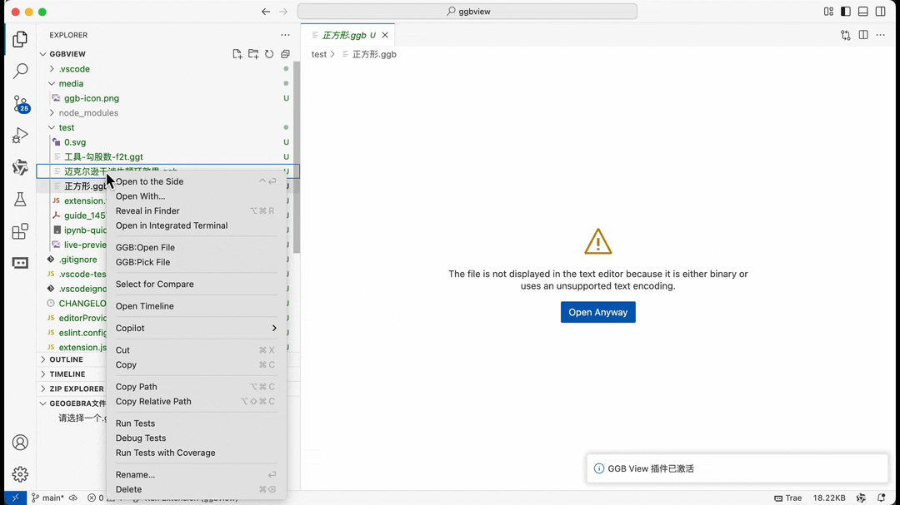

# GeoGebra Viewer (ggbview)

一个用于在 VS Code 中查看 GeoGebra 文件（.ggb 和 .ggt）内容的扩展。
建议初次使用时，设置为ggb文件的默认编辑器
```
    右键 "*.ggb" -> 
        open with. ->
        config default editor for '*.ggb' -> 
        GeoGebra View
```


## problems 

1. 当前打开ggb包内的文件后，是一个没有名字的临时文件，并且再次打开同一个文件还会打开一个新是临时文件
   
2. 文件资源管理器行为
如果你用的是“打开方式”菜单，确保选择了“GeoGebra View”而不是“文本编辑器”。
VS Code 的默认编辑器选择是用户级别的偏好设置，出于安全和体验考虑，不开放 API 让插件自动更改。

## 使用方法

1. 在资源管理器中右键点击 .ggb 文件
2. 选择 "GGB:Pick File" 命令
3. 在侧边栏的 "GeoGebra文件内容" 视图中浏览文件内容
4. 点击文件项可直接在编辑器中打开

## 注意事项

基本的预览ggb功能已经实现，但目前还不支持编辑保存功能。

## solved problems
1. 首先把package.json里的vscode版本改为你的vscode的版本，否则会报错，这里怎么兼容其他的版本呢？
```json
// file:package.json
{
    ...
    "engines": {
---    "vscode": "^1.102.0"
+++    "vscode": "^1.97.0"
    },
    ...
}
```
2. 发布时需要先 npm i 安装依赖
